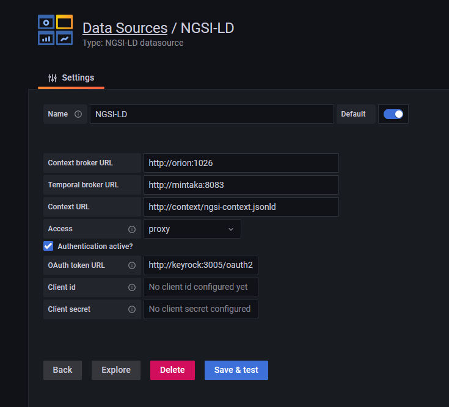

# NGSI-LD Grafana datasource plugin

A Grafana datasource for FIWARE context brokers. Supports temporal, geo and graph data. 

## Usage

The [sample scenario](#run-sample-scenario) included in this repository comes with three sample dashboards which can be used as templates.

**Temporal/Timeseries graphs**

**Current values**

**Map visualization**

**Node graphs**

## Configuration



* Context broker URL (url): The main URL of the FIWARE context broker, e.g. ORION-LD, such as http://localhost:1026
* Temporal broker URL (jsonData.timeseriesUrl): The URL of the temporal endpoint of the FIWARE context broker, e.g. provided by Mintaka, such as http://localhost:8083
* Context URL (jsonData.contextUrl): The URL of the context source, such as http://localhost/ngsi-context.jsonld
* OAuth token URL (jsonData.tokenUrl): When authentication is required to access the context broker, this is the URL of the IDM/OAuth token endpoint, provided for instance by Keyrock. Example: http://localhost:3005/oauth2/token
* Client id (secureJsonData.clientId): The client id for the OAuth client credentials grant flow assigned to Grafana. This must be configured in the IDM.
* Client secret (secureJsonData.clientSecret): The client id for the OAuth client credentials grant flow assigned to Grafana. This must be configured in the IDM.

When using the provided docker compose setup to run Grafana with the datasource, configurations can be provided by means of environment variables, see [Run standalone Grafana with datasource instance](#run-standalone-grafana-with-datasource-instance)

## Folder structure

```
|-- datasource 
       |-- plugin:   Source code of the datasource
       |-- volumes:  Preconfigured Grafana configs (datasource, dashboards) for the sample scenarios
|-- modelSteel:      Data model for the sample scenarios
|-- screenshots:     Screenshots
|-- volumes:         IDM/Keyrock configuration for the authentication scenario
```

## Build the plugin

Use either the Docker workflow or the Node.js workflow.

**Docker workflow**

Switch to the *datasource* directory:

```
cd datasource
```

Install the required dependencies:

```
./install.sh
```

Then build the plugin:

```
./build.sh
```

**Node.js workflow**

Switch to the *plugin* directory:

```
cd datasource/plugin
```

Install the required dependencies:

```
yarn install --ignore-engines
```

Then build the plugin:

```
yarn dev
```


## Run sample scenario

This assumes that the plugin has been built before (see [above](#build-the-plugin)), and requires Docker (docker-compose).
After starting one of the two docker compose scenarios the Grafana frontend will be available at http://localhost:3000. No authentication to Grafana required.

**No authorization**

In this scenario the context broker can be accessed without authentication.

```
./run.sh
```

Stop:
```
./stop.sh
```

**With authorization enabled**

In this scenario the context broker is protected by a [PEP proxy](https://github.com/FIWARE/tutorials.PEP-Proxy), which allows only authenticated users to access the broker. The OAuth 2.0 [client credentials grant flow](https://oauth.net/2/grant-types/client-credentials/) is used for authentication. The datasource plugin gets configured with a client id and client secret, which are used to retrieve an access token from the identity management service. Grafana then forwards this access token to the PEP proxy with every data request (docs here: https://grafana.com/docs/grafana/latest/developers/plugins/add-authentication-for-data-source-plugins/#add-a-oauth-20-proxy-route-to-your-plugin).

```
./run_auth.sh
```

Stop:
```
./stop_auth.sh
```

**Clean up**

In order to perform a clean start, remove all volumes associated to this scenario (stop first):

```
./clean.sh
```

**Update datasource**

After implementing changes in the plugin source code you can update the running instance by executing

```
docker restart fiware-grafana
```

and reload the Grafana tab in the Browser.

## Run standalone Grafana with datasource instance

This assumes that the plugin has been built before (see [above](#build-the-plugin)), and requires Docker (docker-compose).
Switch to the *datasource* directory:

```
cd datasource
```

Then execute either `./run.sh` or 

```
docker compose up -d
```

To stop, run either `./stop.sh` or
```
docker compose down
```

**Configuration options**

* **BROKER_URL**: URL of the context broker. Default: http://host.docker.internal:1026
* **CONTEXT_URL**: URL of the context provider. Default: http://host.docker.internal:3004/ngsi-context.jsonld}
* **TIMESERIES_URL**: URL of the context broker endpoint for temporal queries. Default: http://host.docker.internal:8083
* **TOKEN_URL**: URL of the OAuth token endpoint. Default: empty
* **CLIENT_ID**: OAuth client id. Default: empty
* **CLIENT_SECRET**: OAuth client secret. Default: empty

## License

Apache 2.0
