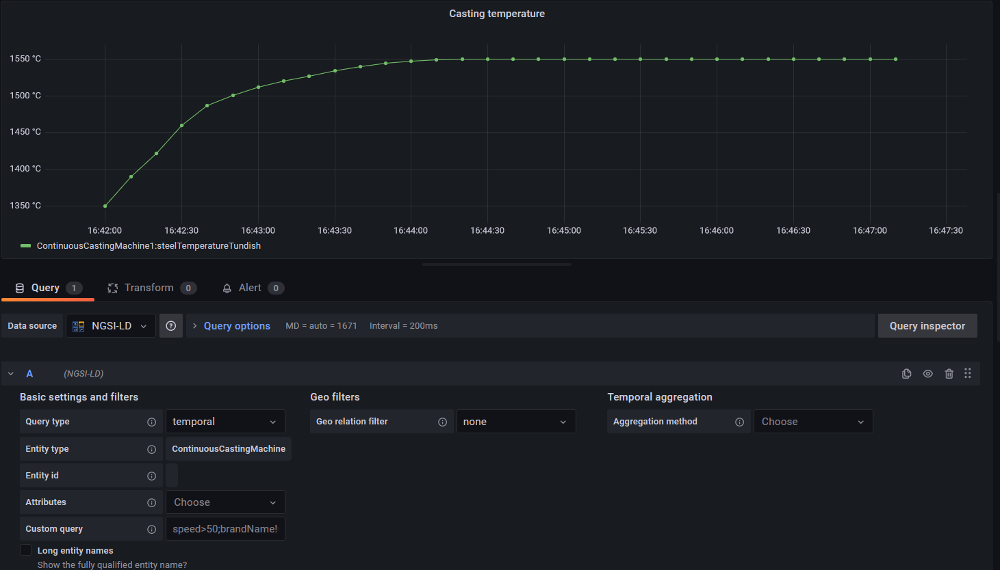
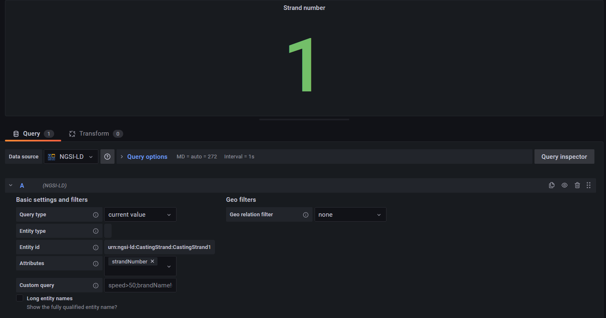
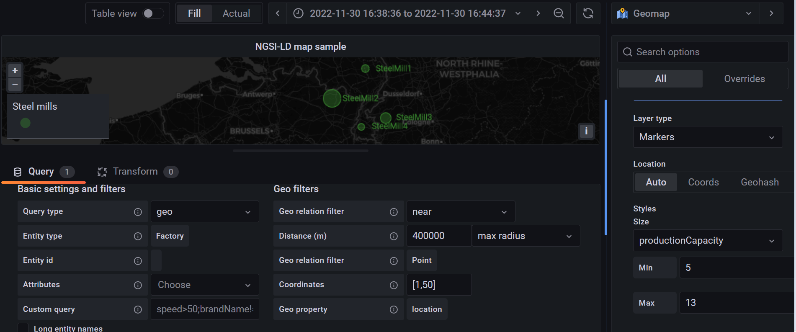
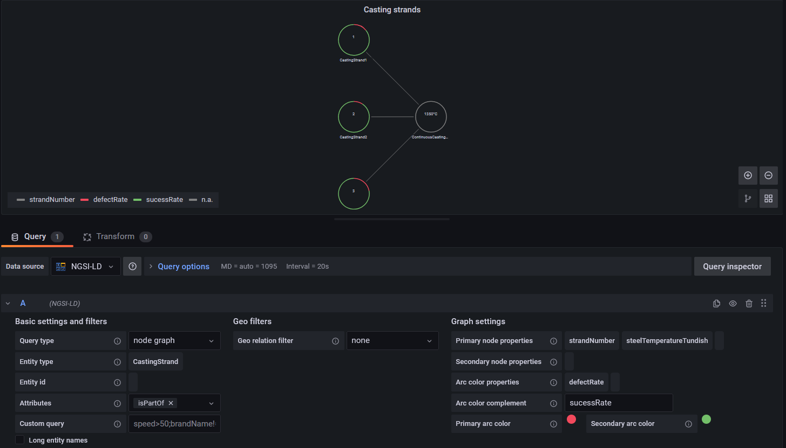

# NGSI-LD Grafana datasource plugin

A Grafana datasource for FIWARE context brokers. Supports temporal, geo and graph data. 

Zenodo link: [](https://doi.org/10.5281/zenodo.7428995)

## Getting started

### Alternative 1: download the released plugin

The datasource plugin is available as a .tgz file from the releases: https://github.com/bfi-de/ngsild-grafana-datasource/releases. 

The following instructions describe one way to spin up a Grafana instance in a Docker container with the datasource plugin loaded. It is not required to clone the git repository, but configuration, creation of dashboards and the setup of the NGSI-LD context broker need to be done separately. For a sample scenario with preconfigured datasource and plugins see [Run git sample scenario](#run-git-sample-scenario) below.

Download the released datasource plugin, decompress it and run Grafana in a Docker containers:

```bash
curl -L https://github.com/bfi-de/ngsild-grafana-datasource/releases/download/v1.1.1/ngsild-grafana-datasource-1.1.1.tgz --output ngsild-grafana-datasource-1.1.1.tgz
tar -zxvf ngsild-grafana-datasource-1.1.1.tgz
MSYS_NO_PATHCONV=1 docker run --rm -d --name grafana-dev -p 3000:3000 \
    -v $(pwd)/ngsild-grafana-datasource:/var/lib/grafana/plugins/ngsild-grafana-datasource:ro \
    -e GF_PATHS_PLUGINS=/var/lib/grafana/plugins \
    -e GF_PLUGINS_ALLOW_LOADING_UNSIGNED_PLUGINS=ngsild-grafana-datasource \
    -e GF_AUTH_ANONYMOUS_ENABLED=true \
    -e GF_AUTH_ANONYMOUS_ORG_ROLE=Admin \
    -e GF_SERVER_DOMAIN=localhost \
    grafana/grafana:latest
```

Create a new data source at http://localhost:3000/datasources/new. Filter for *ngsild* and select the NGSI-LD datasource. On the configuration page for the plugin, enter the URLs of the context provider, NGSI-LD broker and the temporal endpoint. With Docker Desktop on Windows the hostname *host.docker.internal* refers to the internal IP address of the host, which can be convenient if the mentioned services run on the host, too.

To stop Grafana, run `docker stop grafana-dev`. 

### Alternative 2: use the Grafana CLI

An alternative way to install the plugin is via the Grafana CLI. Note that the plugin is currently unsigned and installation of this unsigned plugin must be explicitly enabled. The installation command is

```bash
grafana cli --pluginUrl https://github.com/bfi-de/ngsild-grafana-datasource/releases/download/v1.1.1/ngsild-grafana-datasource-1.1.1.zip plugins install ngsild-grafana-datasource
```

Complete instructions for a dev scenario with whitelisted unsigned plugin id:

Step 1) Run Grafana:

```bash
MSYS_NO_PATHCONV=1 docker run --rm -d --name grafana-dev -p 3000:3000 -e GF_PLUGINS_ALLOW_LOADING_UNSIGNED_PLUGINS=ngsild-grafana-datasource -e GF_AUTH_ANONYMOUS_ENABLED=true -e GF_AUTH_ANONYMOUS_ORG_ROLE=Admin -e GF_SERVER_DOMAIN=localhost grafana/grafana:latest
```

Step 2) Install the plugin in the Docker container:

```bash
docker exec grafana-dev grafana cli --pluginUrl https://github.com/bfi-de/ngsild-grafana-datasource/releases/download/v1.1.1/ngsild-grafana-datasource-1.1.1.zip plugins install ngsild-grafana-datasource
```

Step 3) Restart Grafana container:

```bash
docker restart grafana-dev
```

## Run git sample scenario

The repository contains a sample scenario with preconfigured services.
This assumes that docker (and docker-compose) is installed and running. Clone the repository, then run the following commands in a bash shell (e.g. git Bash on Windows), starting from the repo base folder:

```
cd datasource
./install.sh
./build.sh
cd ..
./run.sh
```

It will spin up an NGSI-LD context broker along with several supporting services and sample data, as well as a Grafana instance with the preconfigured datasource and some sample dashboards. Visit http://localhost:3000/dashboards in the browser to see the dashboards. To shutdown everything, run `./stop.sh`. See [Build the plugin](#build-the-plugin) and [Run sample scenario](#run-sample-scenario) for details and options.

## Datasource configuration

After creating an instance of the datasource, the various URL endpoints for the context broker, context provider and token provider need to be configured.


* Context broker URL (url): The main URL of the FIWARE context broker, e.g. [Orion-LD](https://github.com/FIWARE/context.Orion-LD), such as http://localhost:1026.
* Temporal broker URL (jsonData.timeseriesUrl): The URL of the temporal endpoint of the FIWARE context broker, e.g. provided by [Mintaka](https://github.com/FIWARE/mintaka), such as http://localhost:8083
* Context URL (jsonData.contextUrl): The URL of the context source, such as http://localhost/ngsi-context.jsonld
* OAuth token URL (jsonData.tokenUrl): When authentication is required to access the context broker this is the URL of the IDM/OAuth token endpoint, provided for instance by [Keyrock](https://github.com/ging/fiware-idm). Example: http://localhost:3005/oauth2/token
* Client id (secureJsonData.clientId): The client id for the OAuth client credentials grant flow assigned to Grafana. This must be configured in the IDM.
* Client secret (secureJsonData.clientSecret): The client id for the OAuth client credentials grant flow assigned to Grafana. This must be configured in the IDM.

When using the provided docker compose setup to run Grafana with the datasource, configurations can be provided by means of environment variables, see [Run standalone Grafana with datasource instance](#run-standalone-grafana-with-datasource-instance)

## Query configurations

The [sample scenario](#run-sample-scenario) included in this repository comes with three sample dashboards which can be used as templates.

### Temporal/Timeseries graphs

Timeseries queries are the default query type for this plugin. They retrieve the temporal evolution of an attribute. The temporal query endpoint `/temporal/entities` must be active for this, which is optional for NGSI-LD brokers. When used with Orion-LD, the additional Mintaka component must be present.



### Current values

Queries for the current value of an attribute are supported as well, by selecting the *current value* query type.



### Map visualization

Map visualizations can be realized by means of *geo* queries, and the Grafana [Geomap](https://grafana.com/docs/grafana/latest/panels-visualizations/visualizations/geomap/) panel type. 
Entities matching the selected filter conditions will be shown as markers on the map. The size of the markers and several other properties can be adapted to the values of specified entity attributes in the panel configuration on the right.
 


### Node graphs

By selecting the *node graph* query type the datasource provides input data for the Grafana [Node graph](https://grafana.com/docs/grafana/latest/panels-visualizations/visualizations/node-graph/) panel type. In the dedicated menu for this query type the user can select which attribute values are shown in the nodes and how the color of the nodes will be determined.




## Folder structure

```
|-- datasource 
       |-- plugin:   Source code of the datasource
       |-- volumes:  Preconfigured Grafana configs (datasource, dashboards) for the sample scenarios
|-- modelSteel:      Data model for the sample scenarios
|-- screenshots:     Screenshots
|-- volumes:         IDM/Keyrock configuration for the authentication scenario
```

## Build the plugin

Use either the Docker workflow or the Node.js workflow.

**Node.js workflow**

Switch to the *plugin* directory:

```
cd datasource/plugin
```

Install the required dependencies:

```
npm install
```

Then build the plugin:

```
npm run dev
```

(or `npm run build`)

**Docker workflow**

Switch to the *datasource* directory:

```
cd datasource
```

Install the required dependencies:

```
./install.sh
```

Then build the plugin:

```
./build.sh
```


## Run sample scenario

This assumes that the plugin has been built before (see [above](#build-the-plugin)), and requires Docker (docker-compose).
After starting one of the two docker compose scenarios the Grafana frontend will be available at http://localhost:3000. No authentication to Grafana required.

**No authorization**

In this scenario the context broker can be accessed without authentication.

```
./run.sh
```

Access the Grafana dashboards at http://localhost:3000/dashboards.

Stop:
```
./stop.sh
```

**With authorization enabled**

In this scenario the context broker is protected by a [PEP proxy](https://github.com/FIWARE/tutorials.PEP-Proxy), which allows only authenticated users to access the broker. The OAuth 2.0 [client credentials grant flow](https://oauth.net/2/grant-types/client-credentials/) is used for authentication. The datasource plugin gets configured with a client id and client secret, which are used to retrieve an access token from the identity management service. Grafana then forwards this access token to the PEP proxy with every data request (docs here: https://grafana.com/docs/grafana/latest/developers/plugins/add-authentication-for-data-source-plugins/#add-a-oauth-20-proxy-route-to-your-plugin).

```
./run_auth.sh
```

Access the Grafana dashboards at http://localhost:3000/dashboards.

Stop:
```
./stop_auth.sh
```

**Clean up**

In order to perform a clean start, remove all volumes associated to this scenario (stop first):

```
./clean.sh
```

**Update datasource**

After implementing changes in the plugin source code you can update the running instance by executing

```
docker restart fiware-grafana
```

and reload the Grafana tab in the Browser.

## Run standalone Grafana with datasource instance

This assumes that the plugin has been built before (see [above](#build-the-plugin)), and requires Docker (docker-compose).
Switch to the *datasource* directory:

```
cd datasource
```

Then execute either `./run.sh` or 

```
docker compose up -d
```

To stop, run either `./stop.sh` or
```
docker compose down
```

**Configuration options**

These options can be set via environment variables:

* **BROKER_URL**: URL of the context broker. Default: http://host.docker.internal:1026
* **CONTEXT_URL**: URL of the context provider. Default: http://host.docker.internal:3004/ngsi-context.jsonld}
* **TIMESERIES_URL**: URL of the context broker endpoint for temporal queries. Default: http://host.docker.internal:8083
* **TOKEN_URL**: URL of the OAuth token endpoint. Default: empty
* **CLIENT_ID**: OAuth client id. Default: empty
* **CLIENT_SECRET**: OAuth client secret. Default: empty

Example:

```
CLIENT_ID=my-client CLIENT_SECRET=top-secret docker compose up -d
```

## License

Apache 2.0
